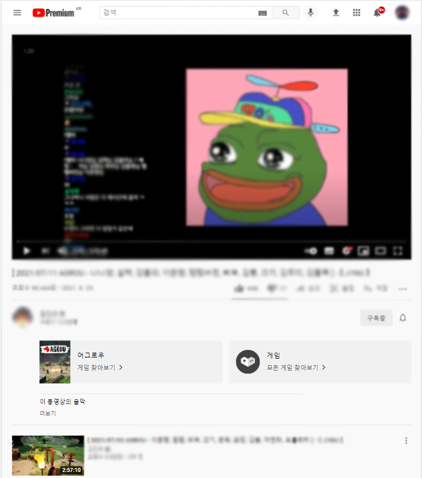
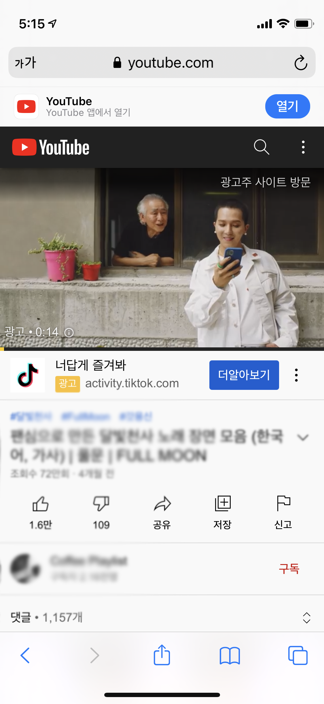
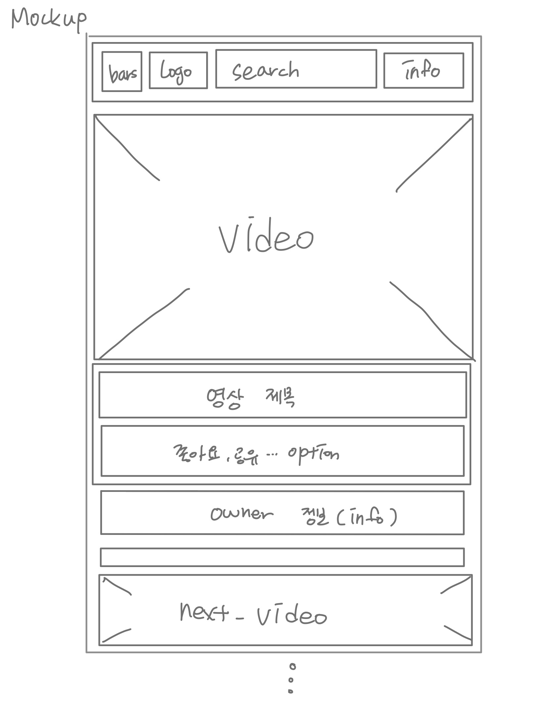

* 이 프로젝트는 공부 목적으로 작성된 youtube 클론코딩입니다.

# 프로젝트 기능
- 반응형(모바일 -> 웹)
- 다크모드 설정(토글 버튼 클릭 시 변환)
- 동영상 CRUD
- 회원기능(Auth, backend: firebase사용 예정)

# 프로젝트 참여인원
- 개인 프로젝트

# 프로젝트 제작 기간
- 2021. 08. 29(SUN) ~ ing(현재 진행 중)

## 원본과의 변경 사항
- 웹 원본( 동영상을 재생했을 시 - 웹에서 모바일 크기만큼 줄여서)

- 모바일 원본(동영상 재생했을 시{Safari 기준})
  

  ## 변경 목업
  